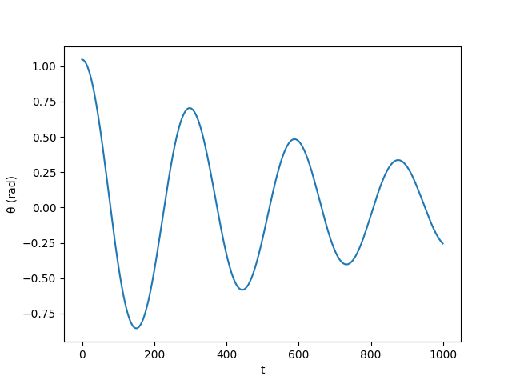

# Pendulum Simulation

A simple pygame simulation of a pendulum.

to install all dependencies
```powershell
pip install -r "requirements.txt"
```

# Demo


# Graph


[](https://www.youtube.com/watch?v=p_di4Zn4wz4&t=522s)
